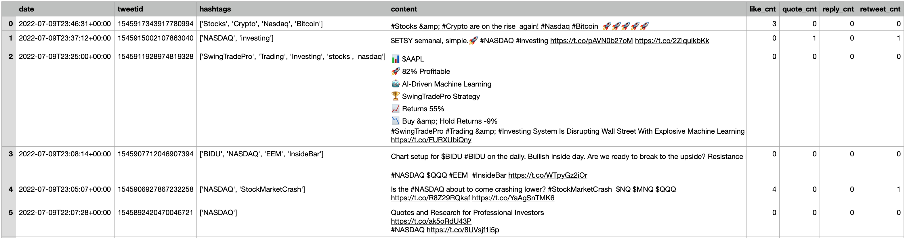

# Web Scraping

Codes for scraping different website (e.g., twitter, IMF). In general, there are three approaches to conduct the web scraping:
- The website has in-built API and it returns formatted json codes after a request. In this case, we just need to import the "json" package in Python and use json.loads() to get the formatted table.
- The website does not have in-built API, but the source codes won't change everytime we request the webpage. In this case, we can use the BeautifulSoup package in Python to parse HTML document.
- The website does not have in-built API, and the source codes changed everytime we request. We can use Selenium package in Python to open a browser, do a clicking and get the current source code like a human being.

Examples:
- Twitter - tweets about Nasdaq

